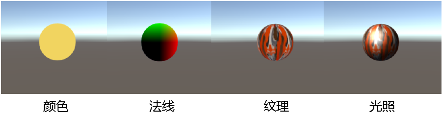
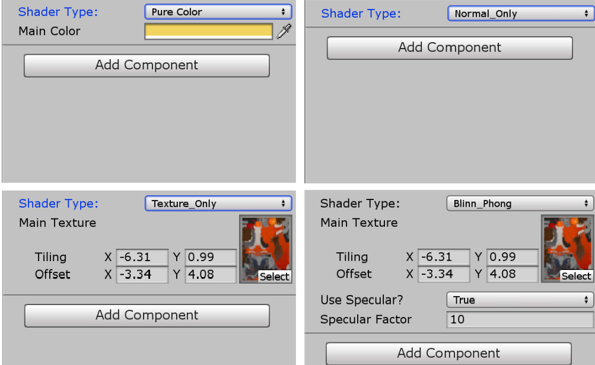
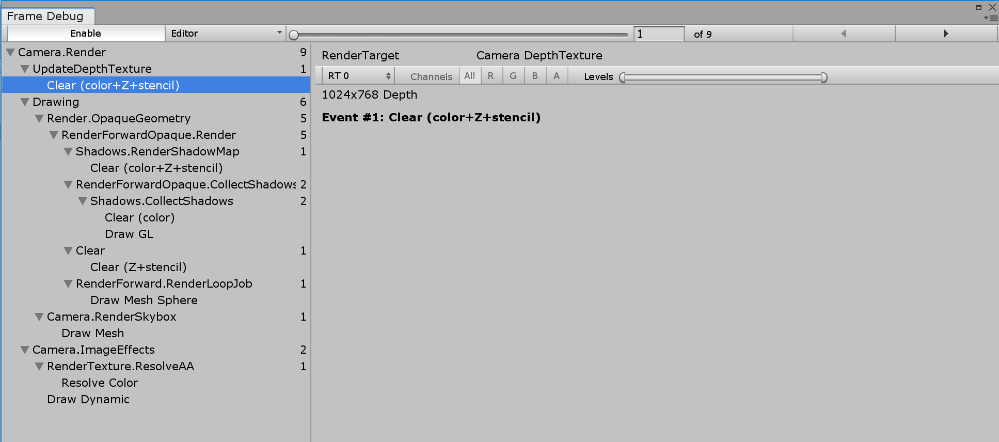
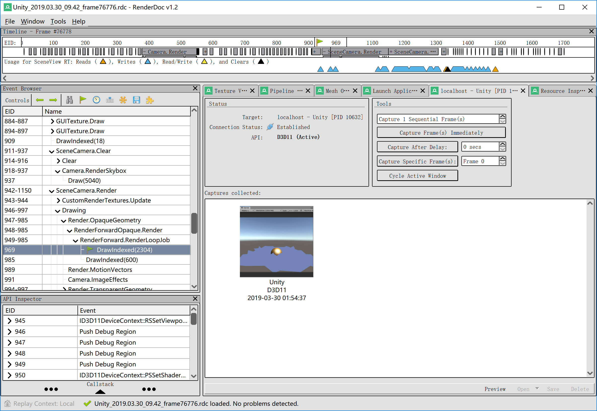
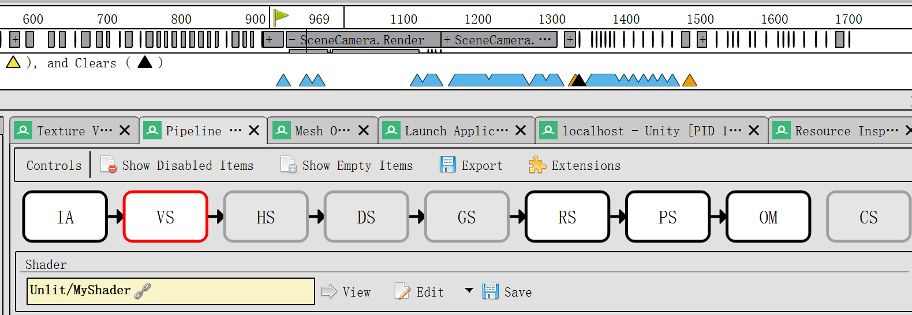
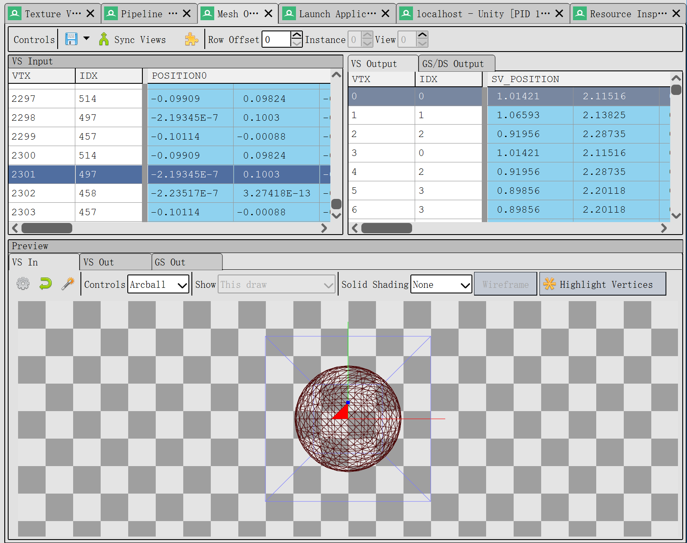
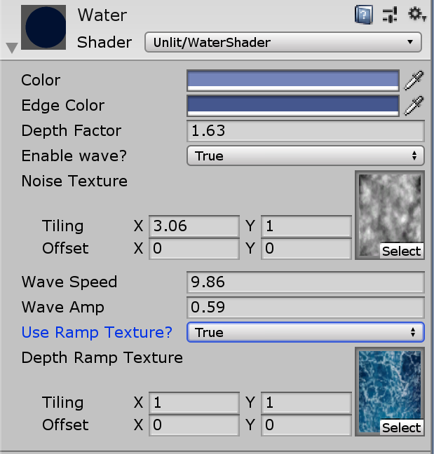
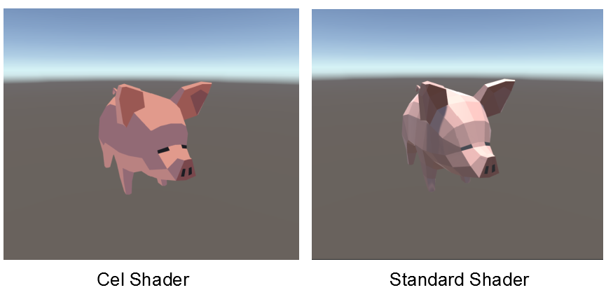
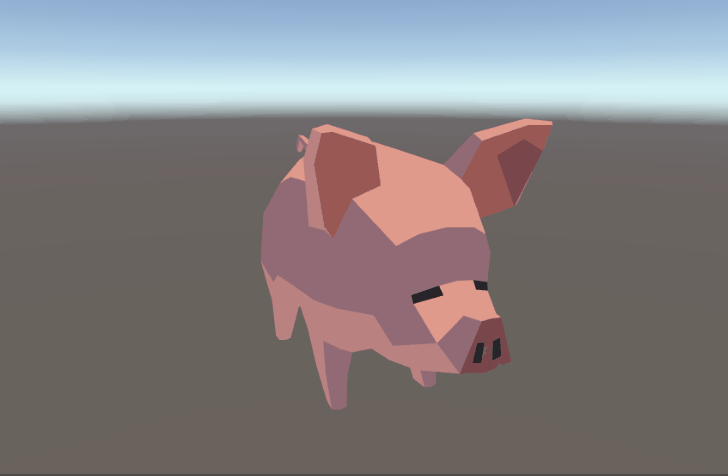

# 技术专题作业3：简单shader的编写 - 报告

516030910101 罗宇辰

------

## 一、 基本要求

### 1. 简易Shader

#### （1）实现过程

- 代码文件：`MyShader.shader`
- 根据doc实现了一个简易的shader，可以渲染显示颜色、法线、纹理贴图和简单光照
- 具体代码：

```c#
    Shader "Unlit/MyShader"
    {
        Properties
        {
            _MainTex ("Main Texture", 2D) = "white" {}
            _MainColor("Main Color", Color) = (1,1,1,1)	//变量名（“显示名”，类型）= 默认值
            _Shininess ("Shininess", float) = 10
        }

        SubShader
        {

            Pass
            {
                CGPROGRAM
                #pragma vertex MyVertexProgram
                #pragma fragment MyFragmentProgram

                //用于GUI中的shader切换
                #pragma shader_feature PURE_COLOR
                #pragma shader_feature NORMAL_ONLY
                #pragma shader_feature TEXTURE_ONLY
                #pragma shader_feature BLINN_PHONG
                #pragma shader_feature USE_SPECULAR

                #include "UnityCG.cginc"
                #include "UnityStandardBRDF.cginc"

                float4 _MainColor;//颜色

                sampler2D _MainTex;//纹理
                float4 _MainTex_ST;//纹理缩放/偏移

                float _Shininess;	//高光乘方系数

                struct VertexData{
                    float4 position: POSITION;	// 类型 变量：语义
                    float3 normal: NORMAL;
                    float2 uv: TEXCOORD0;
                };
                struct FragmentData {
                    float4 position: SV_POSITION;
                    float2 uv: TEXCOORD0;
                    float3 normal: TEXCOORD1;
                    float3 worldPos: TEXCOORD2;
                };

                FragmentData MyVertexProgram(VertexData v)
                {
                    FragmentData i;
                    i.position = UnityObjectToClipPos(v.position);
                    i.normal = UnityObjectToWorldNormal(v.normal);
                    i.uv = TRANSFORM_TEX(v.uv, _MainTex);
                    i.worldPos = mul(unity_ObjectToWorld, v.position);
                    return i;
                }

                float4 MyFragmentProgram(FragmentData i): SV_TARGET
                {
                    #if PURE_COLOR
                        return _MainColor;				//渲染颜色
                    #endif

                    #if NORMAL_ONLY						//渲染法线
                        return float4(i.normal, 1);
                    #endif

                    #if TEXTURE_ONLY					//渲染纹理贴图（无光照）
                        return tex2D(_MainTex, i.uv);
                    #endif

                    #if BLINN_PHONG						//使用Blinn Phong模型渲染光照效果
                        float3 lightDir = _WorldSpaceLightPos0.xyz;
                        float3 lightColor = _LightColor0.rgb;
                        float3 diffuse = tex2D(_MainTex, i.uv).rgb * lightColor * DotClamped(lightDir, i.normal);
                        fixed3 ambient = UNITY_LIGHTMODEL_AMBIENT.xyz * tex2D(_MainTex, i.uv).rgb;
						//以下是根据公式实现的镜面反射效果
                        float3 viewDir = normalize(_WorldSpaceCameraPos - i.worldPos);
                        float3 halfVector = normalize(lightDir + viewDir);
                        float3 specular = float3(0, 0, 0);
                        #if USE_SPECULAR 
                            specular = pow(DotClamped(i.normal, halfVector), _Shininess);
                        #endif

                        return float4(ambient + diffuse + specular, 1);
                    #endif		

                    return _MainColor;
                }
                ENDCG
            }
        }

        CustomEditor "CustomShaderGUI"
    }
```

#### （2）渲染效果




### 2. Shader GUI

#### （1）实现过程

- 代码文件：`CustomShaderGUI.cs`
- 实现了一个简易的shader GUI，可以切换不同类型的shader，并对shader参数进行调整
- 具体代码：

```c#
    public class CustomShaderGUI : ShaderGUI
    {
        MaterialEditor editor;
        MaterialProperty[] properties;
        Material target;
		
        enum ShaderType		//定义了不同类型shader的枚举类型
        {
            PureColor, Normal_Only, Texture_Only, Blinn_Phong
        }
        enum SpecularChoice
        {
            True, False
        }

        public override void OnGUI(MaterialEditor editor, MaterialProperty[] properties)
        {
            this.editor = editor;
            this.properties = properties;
            this.target = editor.target as Material;

            ShaderType shaderType = ShaderType.PureColor;
			
			//根据激活的shader type keyword 改变 shaderType 变量
            if (target.IsKeywordEnabled("PURE_COLOR"))
            {
                shaderType = ShaderType.PureColor;
            }
            else ...

			//显示Popup
            EditorGUI.BeginChangeCheck();
            shaderType = (ShaderType)EditorGUILayout.EnumPopup(
                new GUIContent("Shader Type: "), shaderType
            );

            if (EditorGUI.EndChangeCheck())
            {
                if (shaderType == ShaderType.PureColor)
                {
                    target.DisableKeyword("NORMAL_ONLY");
                    target.DisableKeyword("TEXTURE_ONLY");
                    target.DisableKeyword("BLINN_PHONG");
                    target.EnableKeyword("PURE_COLOR");
                }
                else ...
            }
			//根据不同的shaderType切换展示内容
            if (shaderType == ShaderType.PureColor)
            {
                OnPureColor();
            }
            else if (shaderType == ShaderType.Normal_Only)
            {
                OnNormalOnly();
            }
            else if (shaderType == ShaderType.Texture_Only)
            {
                OnTextureOnly();
            }
            else
            {
                OnBlinnPhong();
            }
        }
        
        //定义了不同类型的shader的GUI内容
        void OnPureColor()       

        void OnNormalOnly()        

        void OnTextureOnly()        

        void OnBlinnPhong()
        
    }

```

#### （2）显示效果




### 3. Debug工具

#### （1）Unity Frame Debugger



- 使用Unity自带的Frame Febugger进行逐帧调试，可以shader是如何将Mesh渲染出来的
- 渲染过程：

```c#
    //开始初始化，清理buffer
	Event #1：Clear（color+Z+stencil）-> Depth
    Event #2：Clear（color+Z+stencil）-> ShadowMap
    Event #3：Clear（color）-> ARGB32
    Event #4：Draw GL -> ARGB32
    Event #5：Clear（Z+stencil）-> ARGBHalf
    //初始化完成
    Event #6：Draw Mesh -> ARGBHalf	//读取mesh shader，keyword，和shader需要用到的一些环境参数（pos，light，texture，etc）
    Event #7：Draw Mesh -> ARGBHalf	//读取天空盒设置
    Event #8：Resolve Color -> ARGBHalf
    Event #9：Draw Dynamic -> Default	//读取纹理扭曲变形值和颜色等参数
    //完成渲染
	

```

#### （2）RenderDoc

- 在Unity的Game模式下截图后，可以使用RenderDoc查看当前画面的渲染过程



- 移动到969帧处可以看到当前的VS shader是MyShader



- 在Mesh Output选项卡中，选中不同的VTX可以看到被渲染的vertex




------

## 二、进阶要求

### 1. Simple Water Shader

#### （1）实现原理

根据[教程](https://lindenreid.wordpress.com/2017/12/15/simple-water-shader-in-unity/)的指导：

1. 利用深度信息来判断模型中哪些部分处于水中
2. 利用color或者texture来绘制物体与水面的交界线
3. 使用噪声贴图产生水面波动的效果和水中的折射变形效果

#### （2）实现过程

为了获取深度的信息，需要使用相机的depth texture

```c#
// DepthTexture.cs
	void Start()
    {
        cam = GetComponent<Camera>();
        cam.depthTextureMode = DepthTextureMode.Depth;
    }
```

然后在shader中采样深度信息

```c#
// WaterShader.shader
			v2f vert (appdata v)
            {
                v2f o;
                
				o.pos = UnityObjectToClipPos(v.vertex);
				o.screenPos = ComputeScreenPos(o.pos);//计算depth信息

                return o;
            }

            fixed4 frag (v2f i) : COLOR
            {                
				float4 depthSample = SAMPLE_DEPTH_TEXTURE_PROJ(_CameraDepthTexture, i.screenPos);//对depth texture进行采样
				float depth = LinearEyeDepth(depthSample).r;		
```

根据property中的DepthFactor设置水面界限宽度，使水越深时这个宽度越小

```c#
				float foamLine = 1 - saturate(_DepthFactor * (depth - i.screenPos.w));
```

可以选择使用color或者texture来为水面分界线着色

```c#
				float4 col = _Color + foamLine * _EdgeColor;	//color	
				//or
				float4 foamRamp = float4(tex2D(_DepthRampTex, float2(foamLine, 0.5)).rgb, 1.0);
				float4 col = _Color * foamRamp;					//texture
				
```

可以通过对噪声纹理进行采样获得随机数值，然后将这个随机值与时间相乘作为每一帧中vertex的偏移量，从而实现波动的效果

```c#
// vert				
				float noiseSample = tex2Dlod(_NoiseTex, float4(v.texCoord.xy, 0, 0));
				o.pos.y += sin(_Time*_WaveSpeed*noiseSample)*_WaveAmp;
				o.pos.x += cos(_Time*_WaveSpeed*noiseSample)*_WaveAmp;
```

进一步利用grabPass实现了水中的折射变形的效果

```c#
    			float noiseSample = tex2Dlod(_NoiseTex, float4(v.uv, 0, 0));
                o.grabPos.y += sin(_Time*_WaveSpeed*noiseSample)*_WaveAmp*_DistortStrength;
                o.grabPos.x += cos(_Time*_WaveSpeed*noiseSample)*_WaveAmp*_DistortStrength;
```

还为WaterShader添加了GUI文件`WaterShaderGUI`，用户可以选择水面分界线的着色方式，也可以选择是否渲染水波效果



#### （3）实现效果

- 折射变形

  

- final


### 2. Cel Shader

#### （1）实现原理

根据[教程](https://lindenreid.wordpress.com/2017/12/19/cel-shader-with-outline-in-unity/)，通过从纹理中取样来设置光照，以实现没有渐变的阴影，产生风格化的渲染效果

#### （2）实现过程

```c#
			fixed4 frag (v2f i) : COLOR
            {
				float3 color = _Color.rgb;

				float3 lightDir = normalize(_WorldSpaceLightPos0.xyz);
				
				// finds location on ramp texture that we should sample
				// based on angle between surface normal and light direction
				float ramp = DotClamped(lightDir, i.normal);
				// 因为RampTex是分块的，不是渐变的，所以光照和阴影处就是两种颜色，没有渐变
				float3 lighting = tex2D(_RampTex, float2(ramp, 0.5)).rgb;
				
                // sample the texture
                fixed4 albedo = tex2D(_MainTex, i.uv);                

				// final color
				float3 rgb = albedo.rgb * lighting * color;

				return float4(rgb, 1.0);
            }
```

#### （3）实现效果




### 3. Dissolve Shader

#### （1）实现原理

根据[教程](https://lindenreid.wordpress.com/2017/12/16/dissolve-shader-in-unity/)，通过在噪声纹理中采样为物体的每个部分赋随机值，然后每一帧减去一定值，值减小到零后就消除该处的像素，实现了物体的各部分逐渐消融的效果

#### （2）实现过程

首先从`noise texture`中采样

```c#
				// sample noise texture
			 	float noiseSample = tex2Dlod(_NoiseTex, float4(i.uv, 0, 0));
```

然后每帧减去一定值

```c#
				// delete choisen pixels
				float threshold = _Time * _DissolveSpeed;
				clip(noiseSample - threshold);
```

可以为消融的部分添加颜色，方法是使用计算略快于消融部位的部分，然后给这一部分着色

```c#
				// edge threshold
				float thresh = _Time * (_ColorThreshold + _DissolveSpeed);
				float useDissolve = noiseSample - thresh < 0;
				// 这一步实现了一个条件判断效果，如果还未消融就不变色，即将消融就变色
				color = (1 - useDissolve)*color + useDissolve * _DissolveColor.rgb;
```

#### （3）实现效果



