# 技术专题作业4：自定义特效（Shader）报告

516030910101 罗宇辰

------

## 一、基于物理的渲染模型

- Shader文件：`Assets/BRDF/MyBRDFShader`

### （1）Distribution term

- 算法公式
  $$
  D_{GGX} = \frac{{\alpha}^2}{\pi((n·h)^2(\alpha^2-1)+1)^2}
  $$

- 实现代码

  ```c#
  	float GGX_D(float roughness, float NdotH)
      {	
  		//// TODO: your implementation
  		float alpha_2 = pow(roughness,2);
  		float nh_2 = pow(NdotH, 2);
  		float GGX = alpha_2 / (UNITY_PI * pow(nh_2*(alpha_2 - 1) + 1, 2));
  				
  		return GGX;
      }
  ```

- 实现效果

  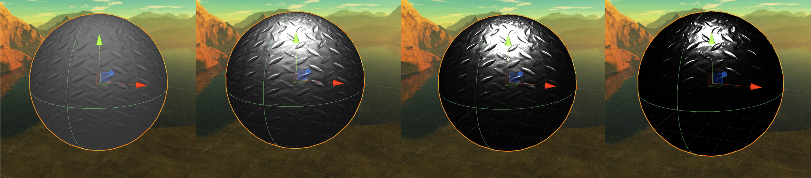

### （2）Fresnel term

- 算法公式
  $$
  F_{Schlick} = R +(1-R)(1-l·h)^5
  $$

- 实现代码

  ```c#
  	float3 Schlick_F(half3 R, half LdotH)
      {
          //// TODO: your implementation
  		float3 F = R + (float3(1, 1, 1) - R) * pow((1 - LdotH), 5);
  		return F;
      }
  ```

- 实现效果

  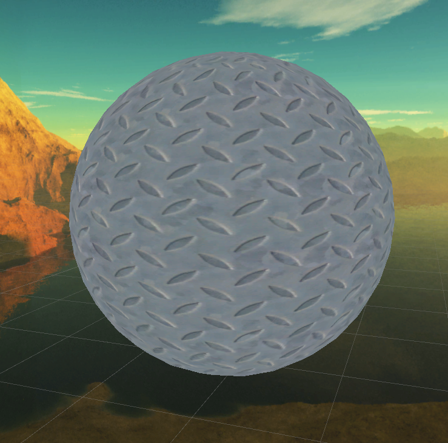

### （3）Geometry term

- 算法公式
  $$
  G_{Cook-Torrance}=\min(1,\frac{2(n·h)(n·v)}{v·h},\frac{2(n·h)(n·l)}{v·h})
  $$

- 实现代码

  ```c#
  	float CookTorrence_G (float NdotL, float NdotV, float VdotH, float NdotH)
      {
          //// TODO: your implementation
  		float G = min(2 * NdotH * NdotV / VdotH, 2 * NdotH * NdotL / VdotH);
  		G = min(1, G);
  		return G;
      }
  ```

- 实现效果

  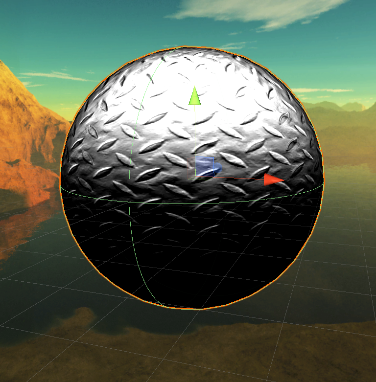

### （4）最终效果

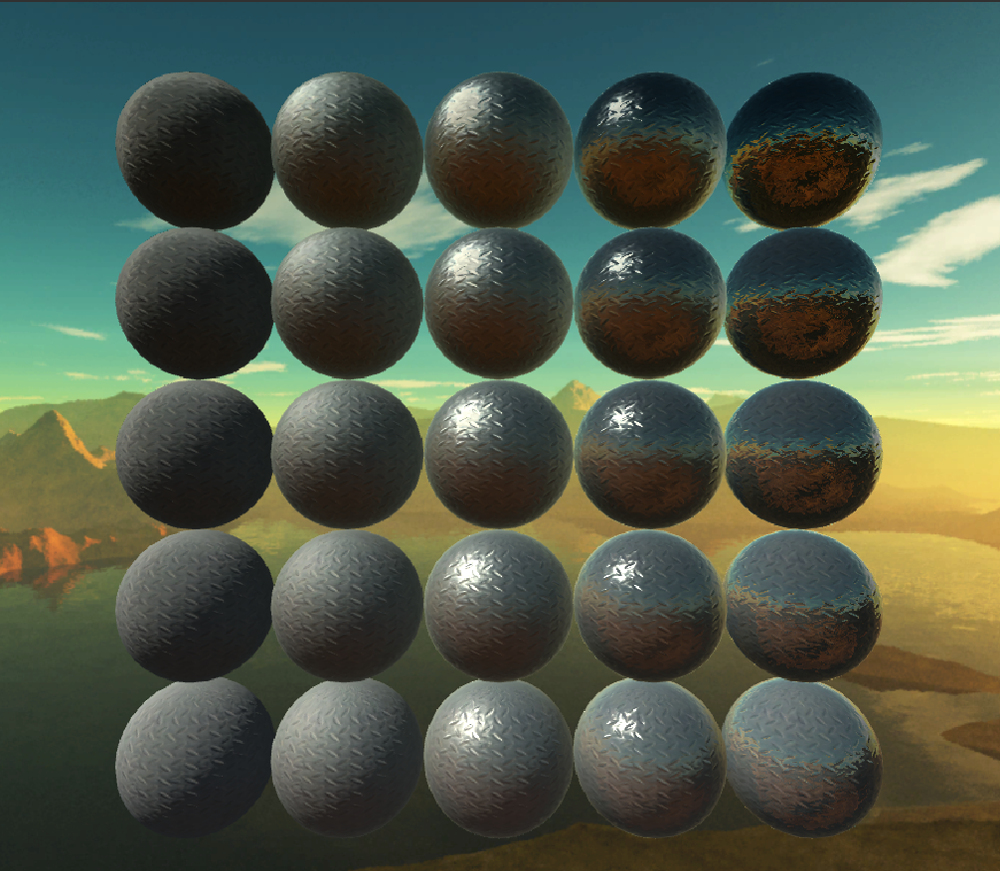


## 二、非真实感渲染——卡通风格渲染

- Shader文件：`Assets/Non-Photorealistic/CartoonShader`

- 根据[llustrative Rendering in Team Fortress 2](http://dalab.se.sjtu.edu.cn/gp/reference/NPAR07_IllustrativeRenderingInTeamFortress2.pdf)实现了View Independent Lighting（Diffuse+Ambient）

- 根据[Unity Toon Shader](https://roystan.net/articles/toon-shader.html)实现了View Dependent Lighting（Specular+Rim）

### （1）View Independent Lighting Terms

根据公式
$$
k_d[a(N)+color_{light}·warping((\alpha(N·L)+\beta)^\gamma)]
$$
计算View Independent Lighting，包括一个修改过的Lambertian项和一个有向的环境光

#### 1. Half Lambert

- 公式：
  $$
  \alpha(N·L)+\beta)^\gamma
  $$

- 原理：给Lambertian项施加scale，bias和exponentiation，使这一项的值归于-1到1之间

- 实现代码：

  ```c#
  				//// 1.1 Half Lambert
  				float alpha = 0.5;
  				float beta = 0.5;
  				float gamma = 1;
  				float3 halfLambert = pow(alpha * NdotL + beta, gamma);
  ```

####  2. Diffuse Warping

- 原理：对Half Lambert项进行warping，讲光强映射到纹理中，实现硬阴影的效果

- 映射纹理图片：

  

- 实现代码

  ```c#
  				//// 1.2 Diffuse Warping Function
  				float ramp = saturate(halfLambert);
  				float3 warpedRGB = tex2D(_LightWarpTex, float2(ramp, 0.5)).rgb;
  				float3 warpedLight = lightColor * warpedRGB;
  ```

#### 3. Directional Ambient Term

- 原理：使用cubemap来实现directional ambient

- Cubemap：

  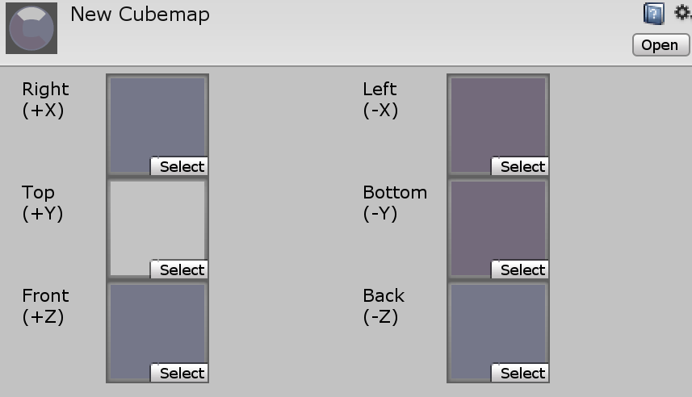

- 实现代码

  ```c#
  				//// 1.3 Directional Ambient Term
  				half3 worldViewDir = normalize(UnityWorldSpaceViewDir(i.worldPos));
  				half3 worldRefl = reflect(-worldViewDir, N);
  				half3 ambient = texCUBE(_CubeMap, worldRefl).rgb;
  ```

#### 4. 实现效果

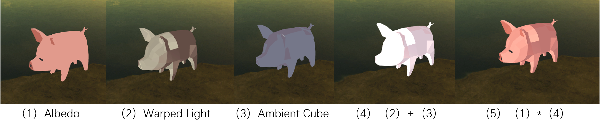

### （2）View Dependent Lighting Terms

#### 1. Specular

- 原理：镜面反射沿用Blinn-Phong模型，加入Fresnel项，使用`smoothstep`来实现卡通效果

- 实现代码

  ```c#
  				//// 2.1 Specular
  				float specularIntensity = pow(NdotH, _kSpec);
  				float specularIntensitySmooth = smoothstep(0.005, 0.01, specularIntensity);
  				float3 F_s = Schlick_F(_specColor.rgb, LdotH);
  				float3 specular = F_s * specularIntensitySmooth * lightColor;
  ```

- 效果

  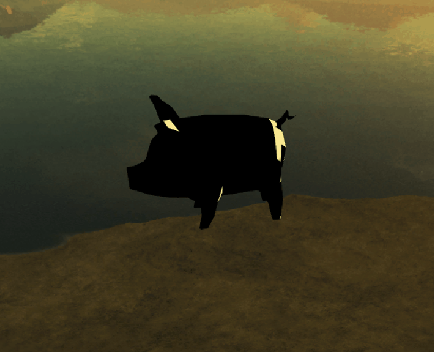

#### 2. Rim Lighting

- 原理：通过为边缘部分增加光照以凸显人物，使用`smoothstep`来实现卡通效果

- 实现代码

  ```c#
  				//// 2.2 Rim Lighting
  				float4 rimDot = NdotV;
  				float rimIntensity = smoothstep(_rimAmount - 0.01, _rimAmount + 0.01, rimDot);
  				float3 F_r = Schlick_F(_rimColor.rgb, LdotH);
  				float3 rim = F_r * rimIntensity * pow(NdotL, _rimAmount);
  ```

- 效果

  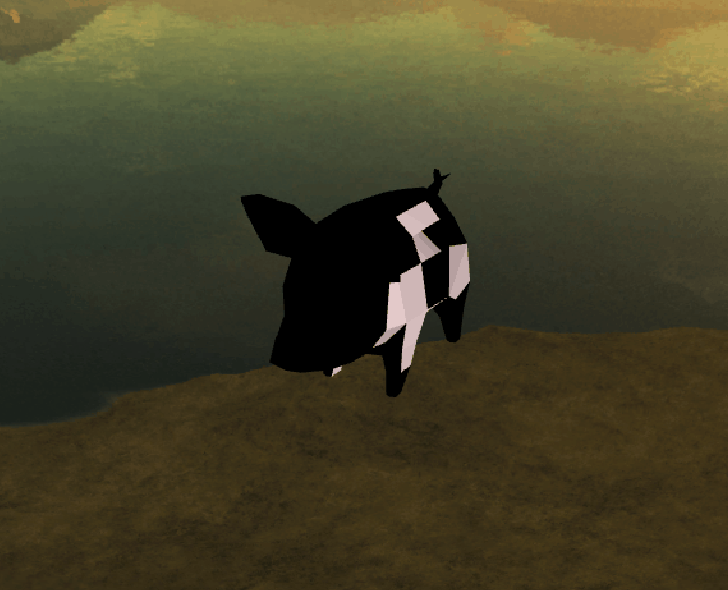

#### 3. 实现效果

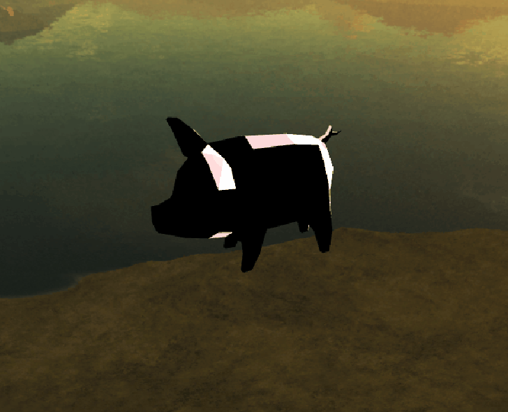

### （3）最终效果

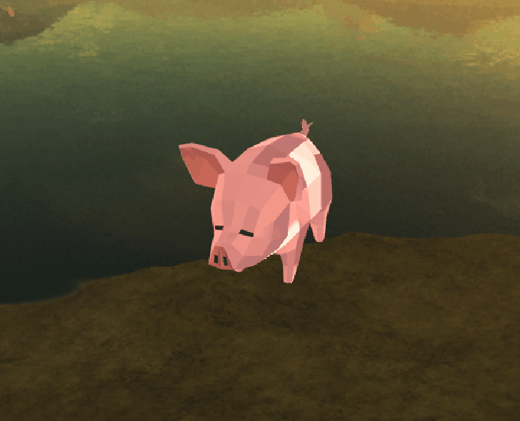

对比`standard shader`下的效果

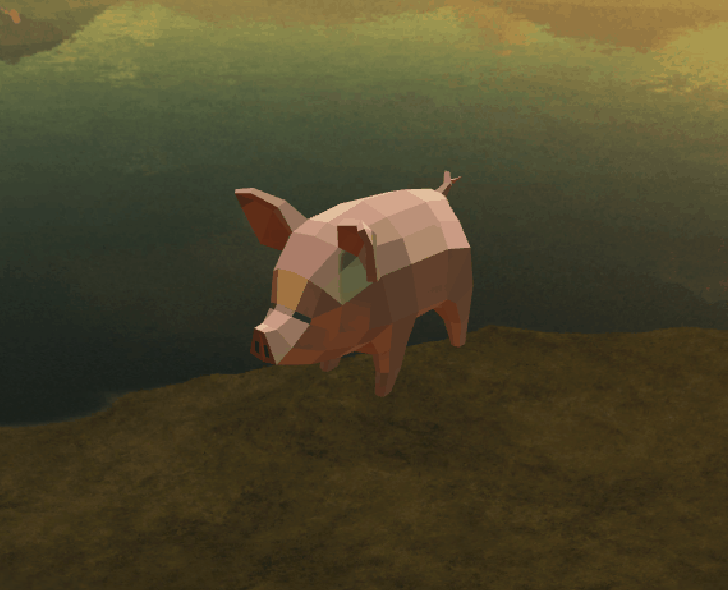

## 三、屏幕后处理效果——全局雾效

- Shader文件：`Assets/Fog/FogGlobal`
- 相机脚本：`Assets/Fog/FogWithDepthTexture`
- 参考资料：
  1. [Real-Time Fog using Post-processing in OpenGL](http://dalab.se.sjtu.edu.cn/gp/reference/fog.pdf), [Reconstructing positions from the depth buffer](http://www.derschmale.com/2014/01/26/reconstructing-positions-from-the-depth-buffer/)
  2. [Unity Shader学习笔记（25）全局雾效](https://gameinstitute.qq.com/community/detail/121021)

### （1）基本流程

根据论文中`4 Implmentation`章节的流程实现了全局雾效

```c
// 1. read fragment depth from depth texture 
// 2. perform scene depth reconstruction 
// 3. compute eye-to-fragment vector compute fragment position in real world 
// 4. compute Euclidean distance between the camera and the fragment 
// 5. evaluate fog integral
// 6. compute alpha value 
```

### （2）具体实现

#### step 1

首先开启相机中的深度纹理

```c#
	camera.depthTextureMode |= DepthTextureMode.Depth;
```

#### step 2

这样片元着色器中就可以读取深度纹理采样信息，计算fragment的线性深度值

```c#
	float linearDepth = LinearEyeDepth(SAMPLE_DEPTH_TEXTURE(_CameraDepthTexture, i.uv_depth));
```

#### step 3

计算近裁切平面中四个角的eye-to-fragment vector

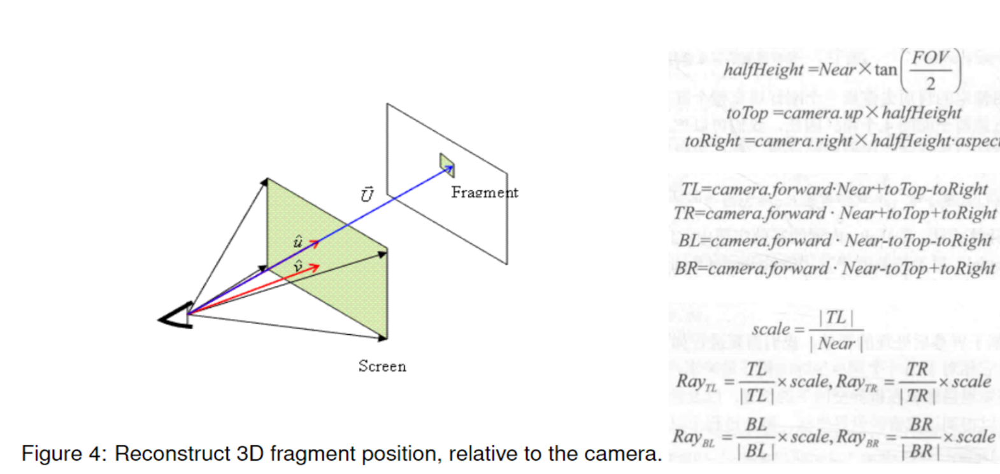

```c#
			Matrix4x4 frustumCorners = Matrix4x4.identity;

            float fov = camera.fieldOfView;
            float near = camera.nearClipPlane;
            float aspect = camera.aspect;

            float halfHeight = near * Mathf.Tan(fov * 0.5f * Mathf.Deg2Rad);
            Vector3 toRight = cameraTransform.right * halfHeight * aspect;
            Vector3 toTop = cameraTransform.up * halfHeight;

            Vector3 topLeft = cameraTransform.forward * near + toTop - toRight;
            float scale = topLeft.magnitude / near;

            topLeft.Normalize();
            topLeft *= scale;

            Vector3 topRight = cameraTransform.forward * near + toRight + toTop;
            topRight.Normalize();
            topRight *= scale;

            Vector3 bottomLeft = cameraTransform.forward * near - toTop - toRight;
            bottomLeft.Normalize();
            bottomLeft *= scale;

            Vector3 bottomRight = cameraTransform.forward * near + toRight - toTop;
            bottomRight.Normalize();
            bottomRight *= scale;

            frustumCorners.SetRow(0, bottomLeft);
            frustumCorners.SetRow(1, bottomRight);
            frustumCorners.SetRow(2, topRight);
            frustumCorners.SetRow(3, topLeft);
```

在顶点着色器中，根据当前位置，选择对应的向量，做插值，得到interpolatedRay即目标fragment，最后传递给片元着色器

```c#
			int index = 0;
			if (v.texcoord.x < 0.5 && v.texcoord.y < 0.5) {
				index = 0;
			}
			else if (v.texcoord.x > 0.5 && v.texcoord.y < 0.5) {
				index = 1;
			}
			else if (v.texcoord.x > 0.5 && v.texcoord.y > 0.5) {
				index = 2;
			}
			else {
				index = 3;
			}

			#if UNITY_UV_STARTS_AT_TOP
				if (_MainTex_TexelSize.y < 0)
					index = 3 - index;
			#endif

			// 插值后的像素向量
			o.interpolatedRay = _FrustumCornersRay[index];
```

#### step 4

计算fragment在世界坐标中的位置

```c#
	float3 worldPos = _WorldSpaceCameraPos + linearDepth * i.interpolatedRay.xyz;
```

#### step 5

根据位置d计算fog的浓度因子`fogDensity`，一般有三种方法：

- 线性：$(d_{max}-|d|)/(d_{max}-d_{min})​$
- 指数：$e^{-i*|d|}$, $i$为浓度控制参数
- 指数的平方：$e^{-(i*|d|)^2}​$, $i​$为浓度控制参数

选用了线性的方法

```c#
			// 雾的浓度
			float fogDensity;
			// 可以通过更改x/y/z来更改雾的方向
			float dist = worldPos.y;

			//线性
			fogDensity = (_FogEnd - abs(dist)) / (_FogEnd - _FogStart);
```

#### step 6

使用浓度因子在雾的颜色和像素原本的颜色之间进行插值，计算最终的颜色

```c#
			// 限制到0~1之间
			fogDensity = saturate(fogDensity * _FogDensity);

			fixed4 finalColor = tex2D(_MainTex, i.uv);
			// 雾的浓度=0的时候，显示原颜色
			finalColor.rgb = lerp(finalColor.rgb, _FogColor.rgb, fogDensity);
```

### （3）实现效果

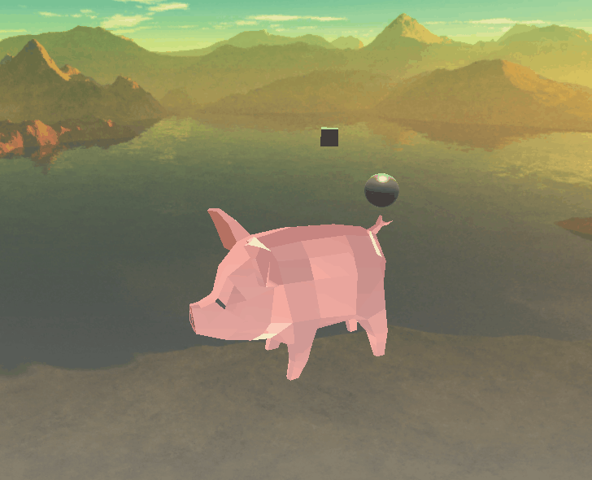

